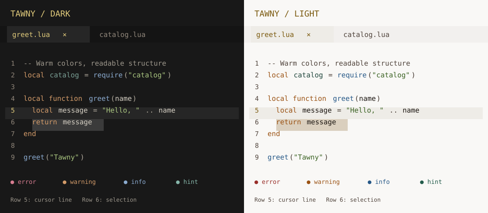

# tawny.nvim

A Neovim colorscheme with readable neutral text, blue and green syntax accents,
and neutral dark or paper-like light backgrounds.



Generated highlight preview showing syntax, the active buffer, cursor line, selection, and diagnostics. Actual rendering depends on your font and terminal.

## Features

- Comprehensive syntax highlighting (Vim syntax + TreeSitter)
- LSP diagnostics support
- Popular plugin integrations:
  - [Telescope](https://github.com/nvim-telescope/telescope.nvim)
  - [nvim-tree](https://github.com/nvim-tree/nvim-tree.lua) / [neo-tree](https://github.com/nvim-neo-tree/neo-tree.nvim)
  - [gitsigns](https://github.com/lewis6991/gitsigns.nvim)
  - [nvim-cmp](https://github.com/hrsh7th/nvim-cmp) / [blink.cmp](https://github.com/Saghen/blink.cmp)
  - [which-key](https://github.com/folke/which-key.nvim)
  - [indent-blankline](https://github.com/lukas-reineke/indent-blankline.nvim)
  - [mini.nvim](https://github.com/echasnovski/mini.nvim)
  - [dropbar.nvim](https://github.com/Bekaboo/dropbar.nvim)
- Dark and light colorschemes
- Optional transparency
- Customizable styles

## Color Palette

| Name       | Dark      | Light     |
| ---------- | --------- | --------- |
| Background | `#181818` | `#f9f8f6` |
| Foreground | `#d5cfc3` | `#1b1510` |
| Red        | `#d87d91` | `#992e29` |
| Orange     | `#d39b69` | `#9a5213` |
| Yellow     | `#e0ca7b` | `#7b5a0f` |
| Green      | `#aac680` | `#3a6222` |
| Teal       | `#86b6aa` | `#235c4b` |
| Blue       | `#8babd0` | `#265887` |
| Violet     | `#c09ec7` | `#6f3e6f` |

Transparency clears the main editing background and gutter. Selection, cursor line,
popups, and buffer tabs retain their palette backgrounds so their states remain visible.

## Installation

### [lazy.nvim](https://github.com/folke/lazy.nvim)

```lua
{
  "r-happy/tawny.nvim",
  priority = 1000,
  config = function()
    require("tawny").setup()
    vim.cmd("colorscheme tawny")
  end,
}
```

### [packer.nvim](https://github.com/wbthomason/packer.nvim)

```lua
use {
  "r-happy/tawny.nvim",
  config = function()
    require("tawny").setup()
    vim.cmd("colorscheme tawny")
  end,
}
```

## Configuration

```lua
require("tawny").setup({
  -- "dark" | "light" | nil
  -- Used when calling require("tawny").load() directly.
  -- :colorscheme tawny and :colorscheme tawny-light are fixed.
  variant = nil,

  -- Enable transparent background
  transparent = false,

  -- Configure colors used by :terminal
  terminal_colors = true,

  -- Customize highlight styles
  styles = {
    comments = { italic = false },
    keywords = { bold = false, italic = false },
  },

  -- Override specific highlight groups
  overrides = function(colors)
    return {
      -- Example: make Normal background transparent
      -- Normal = { bg = colors.none },
    }
  end,
})
```

### Light mode

```lua
vim.cmd("colorscheme tawny-light")
```

## Companion Themes

Regenerate companion theme files from [`lua/tawny/palette.lua`](./lua/tawny/palette.lua) with:

```sh
make generate-companion-themes
```

Regenerate the README highlight preview with `make generate-preview`.

Run `make check` to check generated syntax colors against Neovim's actual
highlights in both variants, translucent editor overlays, cursor colors, terminal
palette consistency, and the tmux colors-only contract. Run generation before
the check when changing the source. No third-party test packages are required.

VS Code and Zed derive their shared syntax roles from the Neovim highlight
definitions: neutral identifiers, properties, types, numbers and punctuation;
blue keywords and functions; green strings; and readable gray comments.
Syntax uses upright text by default. Diagnostic and Git status colors remain distinct.
Token classification still depends on each editor's language
grammar and language server.

### Ghostty

Choose one file in your Ghostty config:

```ini
config-file = /path/to/tawny.nvim/ghostty/color.ghostty
# Light alternative: /path/to/tawny.nvim/ghostty/color-light.ghostty
```

### WezTerm

In your existing `wezterm.lua`, assign the returned colors:

```lua
config.colors = dofile('/path/to/tawny.nvim/wezterm/tawny.lua').colors
-- Light alternative: /path/to/tawny.nvim/wezterm/tawny-light.lua
```

The active tab uses a distinct background and a bold yellow label.

### tmux

To preserve your status bar text and lengths, source the colors-only file:

```tmux
source-file /path/to/tawny.nvim/tmux/tawny-colors.conf
# Light alternative: /path/to/tawny.nvim/tmux/tawny-light-colors.conf
```

Existing inline `#[...]` colors in custom status formats take precedence over
these styles. For Tawny's session/host/time layout as well, use `tmux/tawny.conf`
or `tmux/tawny-light.conf` instead. The original dark file paths remain supported.

### Zed

[zed/tawny.json](./zed/tawny.json) contains both `Tawny` and `Tawny Light`.

Copy or symlink it into your Zed themes directory:

```sh
mkdir -p ~/.config/zed/themes
ln -sf /path/to/tawny.nvim/zed/tawny.json ~/.config/zed/themes/tawny.json
```

Then select `Tawny` or `Tawny Light` from the theme picker.

### VS Code

Tawny is a standalone VS Code theme extension in [vscode](./vscode). It includes:

- `Tawny` (dark)
- `Tawny Light`

For local development, open `vscode/` in VS Code and press `F5`; then select a
theme with **Preferences: Color Theme** in the Extension Development Host. To
create an installable `.vsix` package, run:

```sh
cd vscode
npx @vscode/vsce package
```

The extension is ready for VS Code Marketplace publication once the `r-happy`
publisher is created or verified there.

## License

MIT
